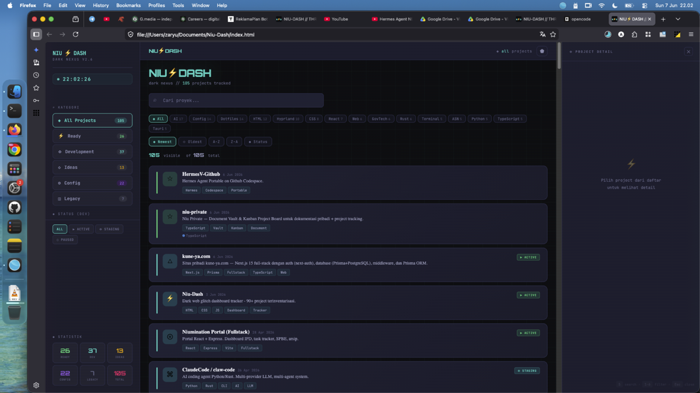

# ⚡NIU———DASH

**Dark Nexus — Project Portfolio Dashboard**

[](https://niumination.github.io/niu-dash)
[](LICENSE)
[](https://niumination.github.io/niu-dash)

> *// teknologi tidak pernah berhenti — semakin cepat, semakin dalam //*
>
> *Technology never stops — faster, deeper*


> *Tampilan three-panel dashboard — sidebar navigasi, feed proyek, detail panel*

Dashboard three-panel **dark cyber** untuk menginventarisasi dan memonitoring seluruh proyek — dari aplikasi web, AI tools, config dotfiles, hingga GovTech SPBE. Dibangun dengan vanilla HTML/CSS/JS, 100% client-side, di-deploy via GitHub Pages.

---

## ✨ Fitur

| Fitur | Status |
|-------|--------|
| **Three-Panel Layout** — Sidebar navigasi + Feed cards + Detail panel | ✅ |
| **105+ Proyek Terinventarisasi** — 5 kategori (Ready, Dev, Ideas, Config, Legacy) | ✅ |
| **DEV TRACKER** — Status tiap proyek (Active / Staging / Paused) + history timeline | ✅ |
| **Live Sorting & Filter** — Sort by newest, oldest, A-Z, Z-A, status | ✅ |
| **Tag Filter Bar** — Filter proyek berdasarkan tag (Top 15) | ✅ |
| **Search** — Real-time pencarian nama, deskripsi, tag | ✅ |
| **GitHub API Integration** — Live stars, forks, language, last updated | ✅ |
| **Auto-Detect Unlisted Repos** — Notifikasi jika ada repo GitHub baru belum terdaftar | ✅ **v2.6** |
| **Dark / Cyber Dim Theme** — Toggle antara Deep Dark & Cyber Dim | ✅ |
| **Particle Network** — Animasi partikel neon di background | ✅ |
| **Mobile Responsive** — Sidebar slide-in, swipe gesture, adaptive layout | ✅ |
| **PWA Ready** — Service worker, manifest, installable | ✅ |
| **🏁 Released Projects** — Halaman khusus proyek production-ready/completed + GitHub auto-sync + data persist online via GitHub API | ✅ **v2.14.x** |
| **Keyboard Shortcuts** — `S` search, `1-6` filter, `Esc` close, arrows navigate | ✅ |
| **Boot Animation** — Immersive startup sequence | ✅ |

---

## 🖥️ Tampilan

```
┌─────────────┬──────────────────────────────────┬──────────────────┐
│  SIDEBAR    │           FEED                   │   DETAIL PANEL   │
│             │                                  │                  │
│  ⚡NIU DASH │  [topbar: NIU⚡DASH | filter]     │  [header]        │
│  ────────   │                                  │                  │
│  🕐 09:53   │  [search bar]                    │  Project Name    │
│             │  [stats: 105 visible of 105]      │  Category · Date │
│  ⌕ Kategori │                                  │                  │
│  ◈ All (105)│  ┌──────────────────────────────┐ │  ▶ ACTIVE        │
│  ⚡ Ready   │  │ ██ Icon  Project Name   NEW │ │                  │
│  ⟐ Dev      │  │          Description.....  │ │  ⟐ Stars · ₒ Forks│
│  ◇ Ideas    │  │          #tag1 #tag2       │ │  · Language       │
│  ⚙ Config   │  │          ★ 12 · ₒ 3 · JS   │ │                  │
│  ◫ Legacy   │  └──────────────────────────────┘ │  DESKRIPSI       │
│             │  ┌──────────────────────────────┐ │  ...             │
│  ◆ Status   │  │ ██ Icon  Project Name       │ │                  │
│  All Active │  │          Description...     │ │  PLAN / ROADMAP  │
│  Staging    │  │          #tag1 #tag2        │ │  ▪ Step one      │
│  Paused     │  └──────────────────────────────┘ │  ▪ Step two      │
│             │  ...                              │                  │
│  Statistik  │                                   │  REKOMENDASI     │
│  23 Ready   │                                   │  ⚠ Priority      │
│  24 Dev     │                                   │                  │
│  29 Ideas   │                                   │  ↗ OPEN REPO     │
│  ...        │                                   │  🌐 VISIT SITE   │
└─────────────┴──────────────────────────────────┴──────────────────┘
```

---

## 🚀 Quick Start

```bash
# Clone repo
git clone https://github.com/Niumination/niu-dash.git
cd niu-dash

# Buka langsung (no build step needed)
open index.html
```

Tidak perlu npm, webpack, atau build tools apapun. Cukup buka `index.html` di browser.

### Deploy ke GitHub Pages

```bash
# Push ke main branch — GitHub Pages auto-deploy
git push origin main
```

Atau atur di **Settings > Pages > Source: Deploy from branch > main**.

---

## 📁 Struktur Proyek

```
niu-dash/
├── index.html          # Aplikasi utama (single file, ~172KB)
├── README.md           # Dokumentasi ini
├── PLAN-v2.14.0.md     # Design plan — implemented
├── manifest.json       # PWA manifest
├── sw.js               # Service worker (caching offline)
├── icon-192.svg        # PWA icons
├── icon-512.svg
├── icon-maskable.svg
└── data/
    └── released.json   # Released projects data (live via GitHub API)
```

**Kenapa satu file?** Niu-Dash sengaja dibuat sebagai single HTML file supaya:
- Zero dependency — gak perlu npm install
- Instant deploy — commit → push → live
- Portable — bisa dibuka dari mana aja termasuk file://
- Mudah di-maintain — semua CSS, JS, HTML dalam satu konteks

---

## 🗂️ Kategori Proyek

| Kategori | Label | Deskripsi |
|----------|-------|-----------|
| `⚡ Ready` | Green | Proyek selesai, stabil, production-ready |
| `⟐ Dev` | Cyan | Dalam pengembangan aktif (dengan status: Active/Staging/Paused) |
| `◇ Ideas` | Amber | Ide, konsep, atau planning phase |
| `⚙ Config` | Purple | Dotfiles, configs, setup tools |
| `◫ Legacy` | Dim | Proyek lama, arsip, atau tidak di-maintain lagi |

---

## 🔧 Fitur Detail

### GitHub Auto-Detection
Setiap kali halaman dimuat, Niu-Dash otomatis fetch daftar repo dari `api.github.com/users/Niumination/repos`. Data di-cache di localStorage selama 1 jam. Jika ada repo GitHub yang **belum terdaftar** di PROJECTS, sidebar akan menampilkan notifikasi **"🚀 Repo Baru Terdeteksi"** dengan jumlah. Klik untuk melihat daftar dan menyalih entry PROJECTS ke clipboard.

### 🏁 Released Projects (v2.14.x)
Halaman khusus untuk melacak proyek yang sudah **Production Ready** atau **Completed**:
- **Manual add** — Pilih repo dari dropdown, set status (Production/Completed), tambah version & notes
- **Auto-sync dari GitHub** — Deteksi repo dengan `has_pages: true`, `homepage`, `archived`, atau topik "production"/"completed"
- **Suggestion panel** — Badge "N waiting review" di sidebar kalau ada repo yang terdeteksi tapi belum diverifikasi
- **Data persist online** — Semua data disimpan ke `data/released.json` via GitHub API (token built-in, aman dari secret detection)
- **Activity feed** — Setiap kali proyek ditandai released, tercatat di activity feed
- **Filter tabs** — [All] [🚀 Production] [✅ Completed]
- **Edit / Remove** — Ubah status atau hapus dari daftar released

### Keyboard Shortcuts
| Key | Aksi |
|-----|------|
| `S` | Fokus ke search bar |
| `1`–`6` | Filter kategori (All, Ready, Dev, Ideas, Config, Legacy) |
| `←` `→` | Navigasi project cards |
| `Esc` | Tutup detail panel |

### Theme Toggle
Klik tombol di topbar untuk toggle antara:
- **Deep Dark** — pure black background, high contrast neon
- **Cyber Dim** — reduced contrast, dimmed neon, lebih nyaman di mata

---

## 🛠️ Tech Stack

- **Vanilla HTML5** — Semantic markup
- **Vanilla CSS3** — CSS Grid, Flexbox, Custom Properties, Animations, Media Queries
- **Vanilla JavaScript ES6** — Async/await, DOM manipulation, localStorage
- **GitHub REST API v3** — Repo stats (stars, forks, language) + write data via `data/released.json` PUT
- **Token Handling** — CharCode array obfuscation (aman dari GitHub secret detection)
- **GitHub Pages** — Hosting & CDN
- **PWA** — Manifest JSON, Service Worker (offline caching)

---

## 🧠 Filosofi

Niu-Dash bukan sekadar project tracker. Ini adalah **command center** visual untuk seluruh ekosistem digital. Setiap proyek — dari yang cuma ide hingga yang sudah production — punya tempatnya sendiri. Dengan live GitHub stats, auto-detection, dan detail panel yang kaya informasi, Niu-Dash memberikan **satu pandangan utuh** tentang apa yang sudah, sedang, dan akan dikerjakan.

---

## 📊 Stats

- **Total Projek:** 105+ (dan terus bertambah)
- **GitHub Repos:** 58+ (auto-detected dari API)
- **Kategori:** 5 (Ready, Dev, Ideas, Config, Legacy)
- **Released:** 🚀 Production + ✅ Completed (via GitHub API sync)
- **File Size:** ~172KB (single HTML + inline CSS/JS)

---

## 📝 Lisensi

MIT © 2026 — Niumination (Afrizal Munthe)

*Dibangun dengan 🌙 dari Aceh Tengah*
